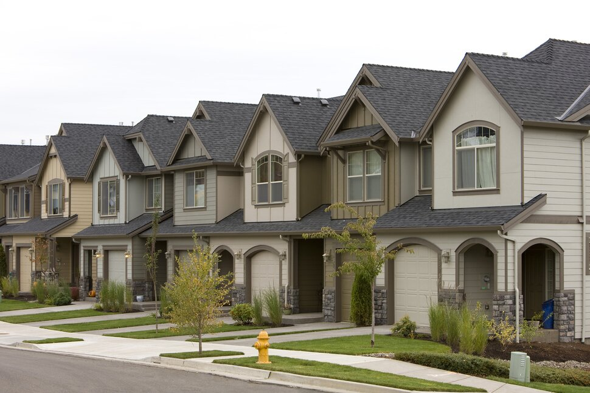

# PHASE-2-PROJECT

## Overview

The real estate industry is a crucial sector that plays a significant role in the economy. The success of a real estate transaction depends on several factors, including the location, the size of the property, the condition of the property, the amenities, and the current market conditions. The housing market is subject to various external factors such as interest rates, economic conditions, and government policies that can impact the demand and supply of properties.

## Business problem 

Some home owners are eager to sell their houses, and I have been approached by a real estate company about how to accurately appraise homes in King county so that they can give their customers accurate recommendations when it comes to buying and selling homes.

By using the dataset provided, I am able to build models that can actually predict sale price of houses. Real estate agents can better advise their clients on pricing strategies, investors can identify potentially undervalued properties, and homeowners can better estimate the value of their own properties. This can ultimately lead to more efficient and profitable real estate transactions in King County.

### Analysis objectives 

* Develop a pricing model.

* Analyze seasonal trends.

## Conclusion 

* The living room size has the highest correlation with price.

* Seasons have the major influence with our price, as houses are sold the highest in price in the spring and the lowest in the winter.

* Houses stated to be in very good condition and have excellent views get to have the highest price.

* The number of bathroom and floors considered a major part of the house as an addtional of each of them amounts to an average of $45,000.

* The variables that have the least influence on the price of the house are: year of renovation, size of the basement and the lot.

## Recommendations

* Put up houses for sale in peak season spring.
* Ensure that the houses are in good condition before putting it into the market for sale.
* Revonate their house since this increases the value of the house.
* Increase square footage of living space.